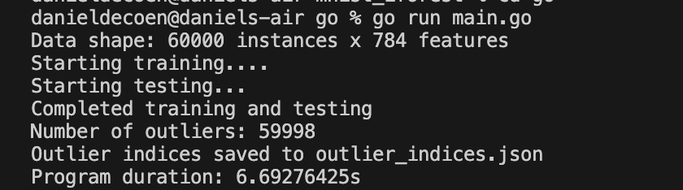
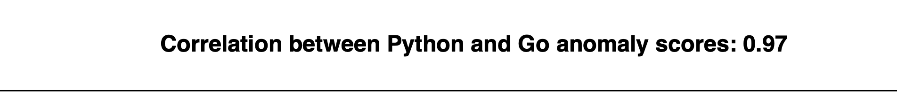
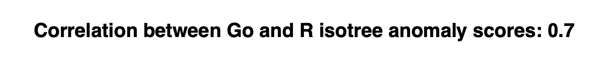

# mnist_iforest
data cleaning and work around isolation forest

### Summary

This project deals with outlier detection using isolation forest. The project mainly focuses on using Go for isolation forest outlier detection. Both Python and R are used as benchmarks to compare the correlation for each method. The three methods that produced the best results are listed below:
1. Python and scikit-learn
2. R using isotree
3. Go using i-forest (https://github.com/e-XpertSolutions/go-iforest/tree/master)

### Data
The data used for this project was [MNIST](https://en.wikipedia.org/wiki/MNIST_database), a database famous for its use in machine learning and image recognition. In order to read in the large amount of data to memory, the [GoMNIST](https://github.com/petar/GoMNIST) package was used. 

### Analysis and results
Go did a good job of reading in all the image data and the overall code using go-iforest was pretty streamlined. The overall time to run the program was coming in around 7 seconds. See overall results from program below:  

**Comparison of Go vs Python**

**Comparison of Go vs R**

Additional information and figures can be found in the results folder. The results folder contains analysis generated via an R script that compared all of the isolation forest related scores from Python, R, and Go. 
